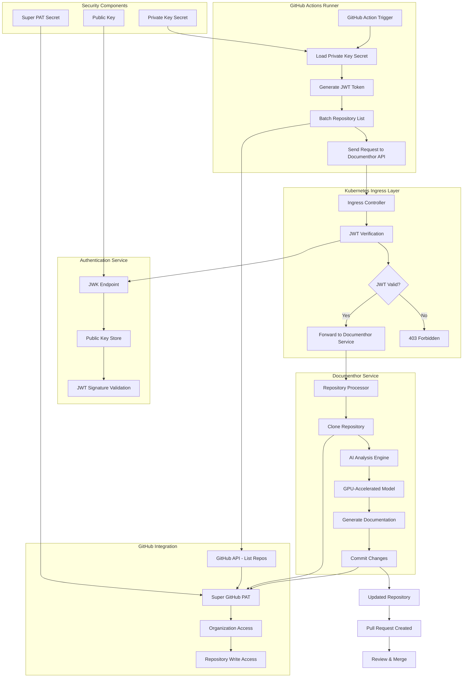
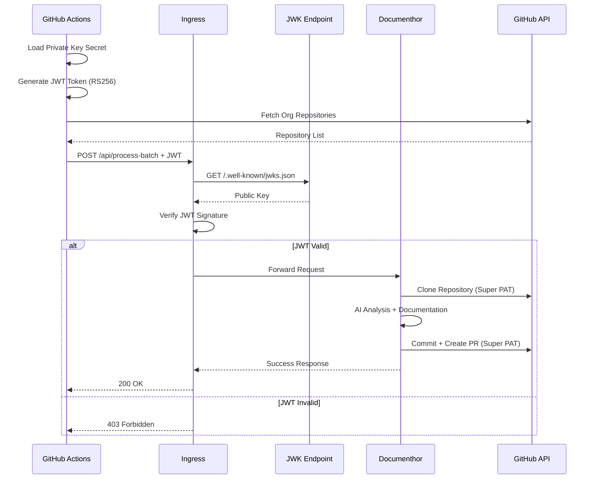
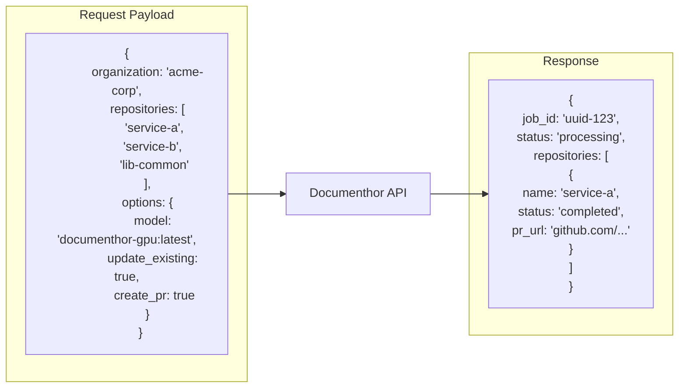

# Documenthor Enterprise Architecture

## Professional Automated Documentation Pipeline

This architecture enables secure, scalable, automated documentation generation for entire GitHub organizations.

## Authentication Flow Detail

## API Contract

